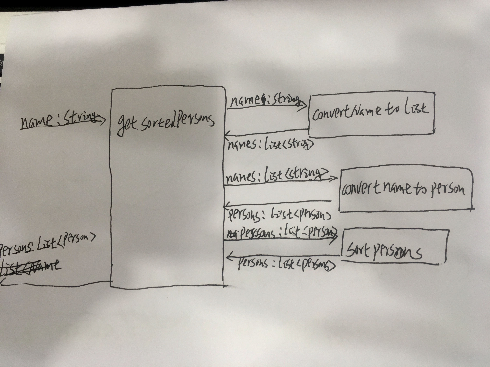

1. 一个基本的Gradle配置由那几部分组成，它们各代表什么含义？

ans: gradle由 `plugin`,`repositories`,`dependency`,`tasks`组成。

    * plugin的作用：顾名思义，这个就是插件的意思，可以添加你所需要的插件。插件[查找地址](https://plugins.gradle.org/)
    
    * repositories 就是仓库，不同的依赖可能在不同的仓库，所以需要配置这些东西。默认是maven。
    
    * dependency 就是依赖，这个用的最频繁，当前项目依赖的各种类库，都可以从这里进行配置。
    
    * tasks 任务，gradle 可以自定义任务，并且可以通过 `gradle task --all`找到所有的命令，还可以通过`gradle [taskName]`执行相应的task。
    
2. 单元测试主要测什么？

单元测试主要用于保证系统功能的正确性。主要测试系统的功能是否如我们所期待的那样。

3. 你觉得单元测试和TDD有哪些好处？
测试可以保证你功能时时刻刻都在正常的运行着。如果重构改变了系统的原有功能，单元测试可以帮助我们快速发现问题。
TDD可以保证让你以最快的速度实现你的需求（测试变绿），避免了前期的无用设计。

4. 分组排序

5. 订单生成

